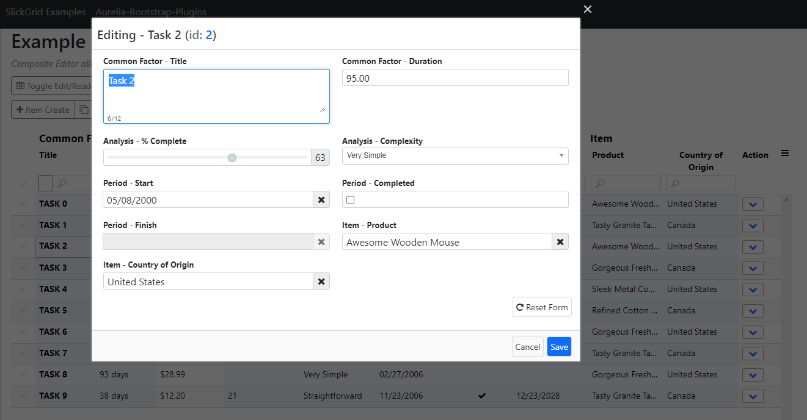

# Aurelia-Slickgrid

## Documentation
📕 [Documentation](https://ghiscoding.gitbook.io/aurelia-slickgrid/getting-started/quick-start) website powered by GitBook.

## Installation
Refer to the **[Docs - Quick Start](https://ghiscoding.gitbook.io/aurelia-slickgrid/getting-started/quick-start)** and/or clone the [Aurelia-Slickgrid Demos](https://github.com/ghiscoding/aurelia-slickgrid-demos) repository. Please review the [Documentation](https://ghiscoding.gitbook.io/aurelia-slickgrid/) website before opening any new issue, also consider asking installation and/or general questions on [Stack Overflow](https://stackoverflow.com/search?tab=newest&q=slickgrid) unless you think there's a bug with the library.

```sh
npm install aurelia-slickgrid
```
Install any optional Slickgrid-Universal dependencies, for example Excel Export
```sh
npm install @slickgrid-universal/excel-export
```

### Demo page

`Aurelia-Slickgrid` works with all `Bootstrap` versions, you can see a demo of each one below. There are also extra styling themes for not just Bootstrap but also Material & Salesforce which are also available. You can also use different SVG icons, you may want to look at the [Docs - SVG Icons](https://ghiscoding.gitbook.io/aurelia-slickgrid/styling/svg-icons)
- [Bootstrap 4 demo](https://ghiscoding.github.io/aurelia-slickgrid-demos) / [examples repo](https://github.com/ghiscoding/aurelia-slickgrid-demos/tree/master/webpack-bs4-demo)
- [Bootstrap 5 demo](https://ghiscoding.github.io/aurelia-slickgrid) / [examples repo](https://github.com/ghiscoding/aurelia-slickgrid-demos/tree/master/webpack-bs5-demo)

## License
[MIT License](LICENSE)

## Screenshots

Screenshots from the demo app with the `Bootstrap` theme.

### Slickgrid example with Formatters (last column shown is a custom Formatter)

#### You can also see the Grid Menu opened (aka hambuger menu)


### Filter and Sort (clientside with DataView)


### Editors and/or onCellClick


### Pinned (aka frozen) Columns/Rows


### Draggable Grouping & Aggregators


### Slickgrid Example with Server Side (Filter/Sort/Pagination)
#### Comes with OData & GraphQL support (you can implement custom too)


### Composite Editor Modal Windows

